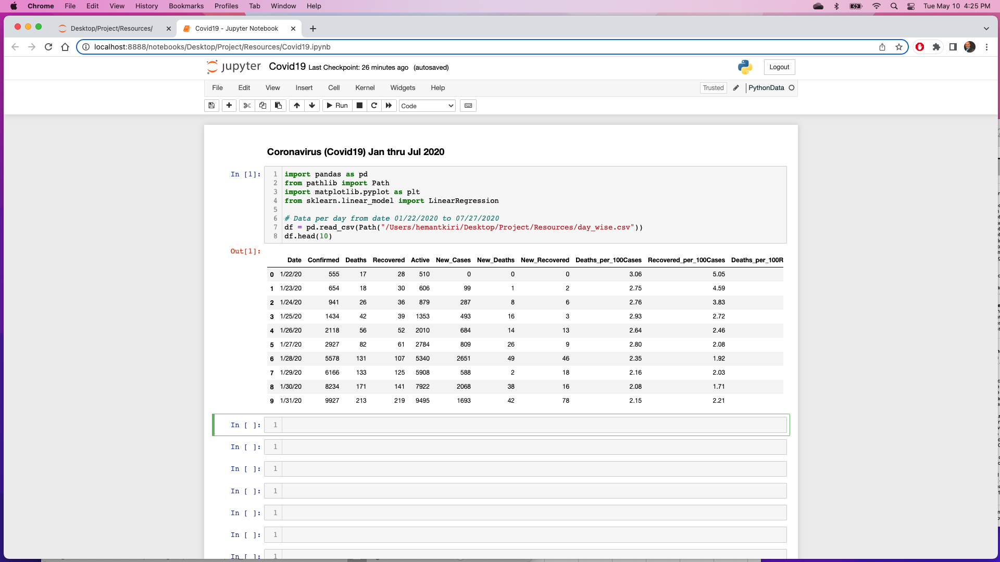
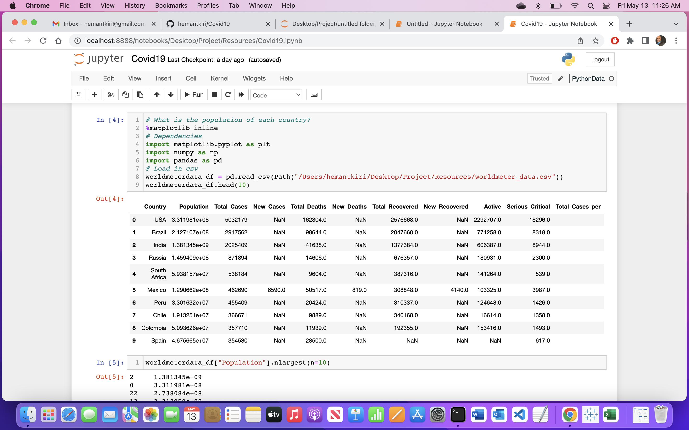
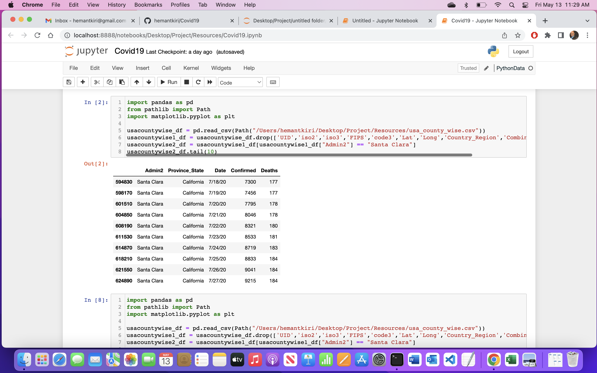
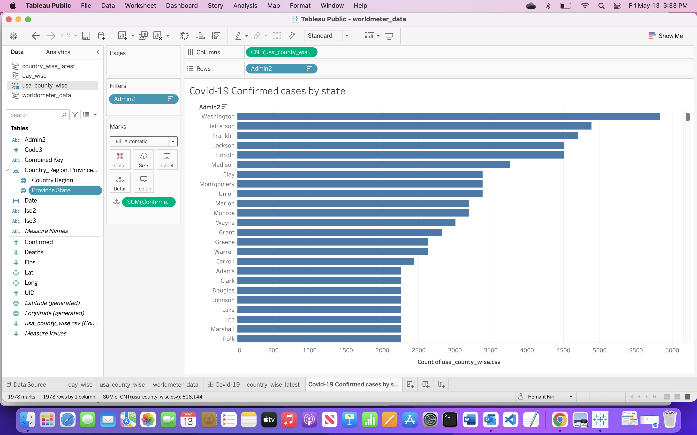
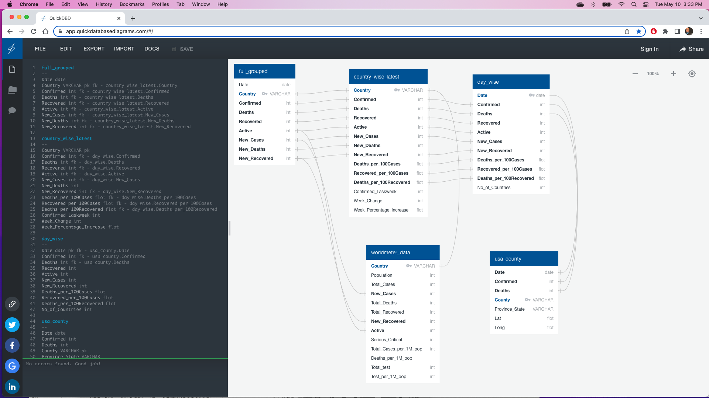
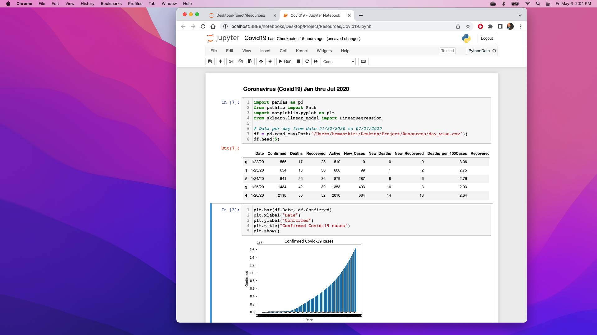

# Covid19

## Content
## Selected topic: Coronavirus (Covid-19).

Covid-19, an acute respiratory illness in humans caused by coronavirus. Virus is capable of producing severe symptoms and in some cases death,
especially in older people and those with underlying health condition. It was originally identified in Wuhan, China in 2019 and because pandemic in 2020.
Since the virus has shown evidence of human-to-human transmission, by the end of January 2020, approximately over 8000 cases have been confirmed.

## Reason the topic was selected:
Covid-19 is a situation that has affected many people worldwide and has changed their lifestyles in many ways.
* Unlimited hours of doctors and nurses’ job duties to save someones' lives.
* Online schools classes and exames.
* Online work.
* Online business increase but small businesses got closed.

## Description of the source of data: 
https://www.kaggle.com/datasets/imdevskp/corona-virus-report?resource=download
https://www.worldmeters.info/

## Here are some questions to get an answers with this data:

* What is the population of each country?
* How many people died in each country daily?
* How many people got effected daily?
* How many people got affected on a weekly basis and how many people died from each country on a weekly basis?
* How quickly Covid-19 will hit to all countries in the world?
* How many people got affected and died from Santa Clara County?

----------------------------------------------------------------------------------------------------------------
## GitHub Repository:
   	
## Description of the communication protocols:
I do not have any project member for communication.

https://github.com/hemantkiri/Covid19

----------------------------------------------------------------------------------------------------------------	
## Machine Learning Model

## Takes in data in from above description of the source of data:
I am using Regression model from Supervised Learning to find "how quickly Covid-19 will hit to all the coundries in the world"?

During the fiest seven months of 2020, vaccination was not found and any guideline to prevent from Covid-19 was not inplace,
so prediction in confirm and deaths cases was unexpected.

## Outputs label(s) for input data:

## What is the population of each country?

## How many people got affected and died from Santa Clara County?

Covid-19 Confirmed cases by state

----------------------------------------------------------------------------------------------------------------
## Database Integration

## Sample data that mimics the expected final database structure or schema:

Also upload "Covid19.sql".

## Draft machine learning module is connected to the provisional database:

